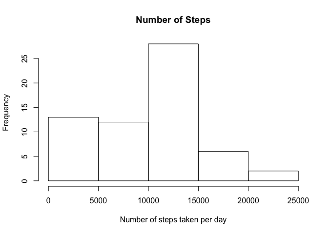
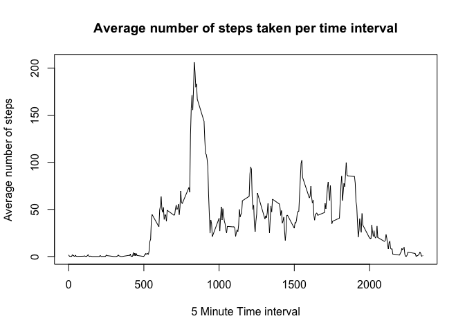
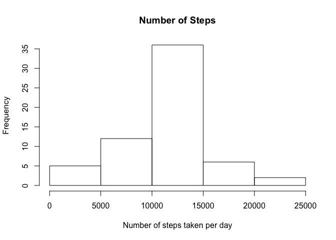
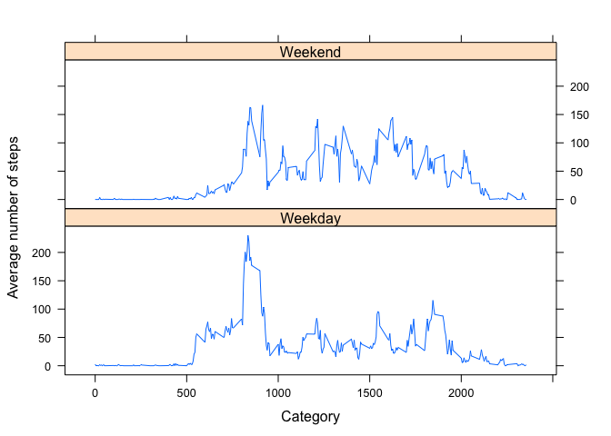

# Reproducible Research: Peer Assessment 1


## Loading and preprocessing the data


```r
#Set working drive
setwd("/Users/kidstyx/Google Drive/Coursera/reproducible_research/Project1/RepData_PeerAssessment1")

#Read in activity data
activitydata <- read.csv("activity.csv")
```
## What is mean total number of steps taken per day?


```r
#Sum up total number of steps taken each day
totalsteps <- aggregate(activitydata$steps, by=list(Category=activitydata$date), FUN=sum, na.rm = TRUE)

#Drawing a histogram of number of steps taken each day
hist(totalsteps$x, xlab = "Number of steps taken per day", main = "Number of Steps")
```

\

```r
#Calculating and reporting mean number of steps taken per day
print(c("The mean number of steps taken per day is: ", mean(totalsteps$x)))
```

```
## [1] "The mean number of steps taken per day is: "
## [2] "9354.22950819672"
```

```r
#Calculating median number of steps taken per day
print(c("The median number of steps taken per day is: ", median(totalsteps$x)))
```

```
## [1] "The median number of steps taken per day is: "
## [2] "10395"
```


## What is the average daily activity pattern?


```r
#Calculating average number of steps per time interval
timeintervalsteps <- aggregate(activitydata$steps, by=list(Category=activitydata$interval), FUN=mean, na.rm = TRUE)

#Plotting time series graph
plot(timeintervalsteps$Category, timeintervalsteps$x, type = "l", main = "Average number of steps taken per time interval", ylab = "Average number of steps", xlab = "5 Minute Time interval")
```

\

```r
#Looking up interval at which average number of steps is the highest
maxsteps <- max(timeintervalsteps$x)
print(c("The maximum average number of steps taken is: ", maxsteps))
```

```
## [1] "The maximum average number of steps taken is: "
## [2] "206.169811320755"
```

```r
maxstepinterval <- timeintervalsteps$Category[which.max(timeintervalsteps$x)]
print(c("The time interval at which the average number of steps taken is the highest is: ", maxstepinterval))
```

```
## [1] "The time interval at which the average number of steps taken is the highest is: "
## [2] "835"
```


## Imputing missing values


```r
#identify all NA values
NAsteps <- subset(activitydata, is.na(activitydata$steps))
print(c("The number of NA steps in the activity data is: ", nrow(NAsteps)))
```

```
## [1] "The number of NA steps in the activity data is: "
## [2] "2304"
```

```r
NAdates <- subset(activitydata, is.na(activitydata$date))
print(c("The number of NA steps in the activity data is: ", nrow(NAdates)))
```

```
## [1] "The number of NA steps in the activity data is: "
## [2] "0"
```

```r
#flll in NA values with average number of steps for the time interval
activitydata2 <- activitydata
for (i in 1:nrow(activitydata)) {
        if(is.na(activitydata$steps[i])){
                activitydata2$steps[i] <- timeintervalsteps$x[timeintervalsteps$Category == activitydata[i, "interval"]]
        }
}

#Sum up total number of steps taken each day
totalsteps2 <- aggregate(activitydata2$steps, by=list(Category=activitydata2$date), FUN=sum)

#Drawing a histogram of number of steps taken each day
hist(totalsteps2$x, xlab = "Number of steps taken per day", main = "Number of Steps")
```

\

```r
#Calculating and reporting mean number of steps taken per day
print(c("The mean number of steps taken per day is: ", mean(totalsteps2$x)))
```

```
## [1] "The mean number of steps taken per day is: "
## [2] "10766.1886792453"
```

```r
#Calculating median number of steps taken per day
print(c("The median number of steps taken per day is: ", median(totalsteps2$x)))
```

```
## [1] "The median number of steps taken per day is: "
## [2] "10766.1886792453"
```

```r
print(c("The number of steps taken per day has changed from first part of the assignment and mean and median are now the same."))
```

```
## [1] "The number of steps taken per day has changed from first part of the assignment and mean and median are now the same."
```


## Are there differences in activity patterns between weekdays and weekends?


```r
#Identify weekdays
activitydata2$weekdays <- weekdays(as.Date(activitydata2$date))

#Derive whether day is weekday or weekend
activitydata2$weekdayclassify <- ifelse(activitydata2$weekdays %in% c("Saturday","Sunday"), "Weekend","Weekday")

#split data into weekdays and weekends
weekdaydata <- activitydata2[activitydata2$weekdayclassify == "Weekday", ]
weekenddata <- activitydata2[activitydata2$weekdayclassify == "Weekend", ]

#Calculating average number of steps per time interval
weekdaysteps <- aggregate(weekdaydata$steps, by=list(Category=weekdaydata$interval), FUN=mean)
weekendsteps <- aggregate(weekenddata$steps, by=list(Category=weekenddata$interval), FUN=mean)

#add weekday or weekend column and combine the two datasets
weekdaysteps$weekday <- "Weekday"
weekendsteps$weekday <- "Weekend"
averagestepdata <- rbind(weekdaysteps, weekendsteps)

#Plotting time series graph
library(lattice)
xyplot(x ~ Category | weekday, data = averagestepdata, layout = c(1, 2), type = "l", ylab = "Average number of steps")
```

\
